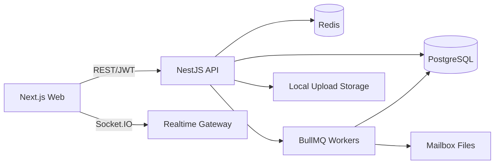

# Architecture

```mermaid
flowchart LR
  WEB[Next.js Web] -->|REST/JWT| API[NestJS API]
  WEB -->|Socket.IO| WS[Realtime Gateway]
  API --> DB[(PostgreSQL)]
  API --> REDIS[(Redis)]
  API --> QUEUE[BullMQ Workers]
  QUEUE --> DB
  QUEUE --> MAIL[Mailbox Files]
  API --> FS[Local Upload Storage]
```

## Notes
- Correlation IDs are propagated via middleware.
- Audit logs are written for every critical write.
- Notifications fan out to in-app storage and mailbox email simulation.
